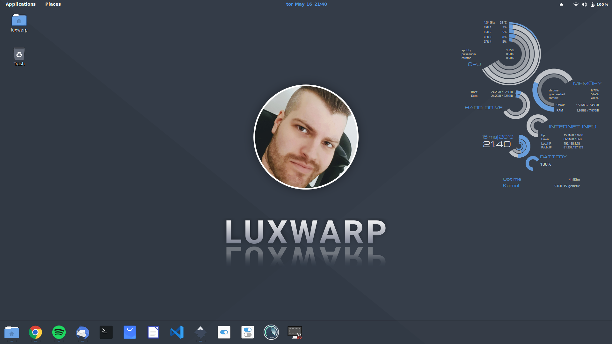
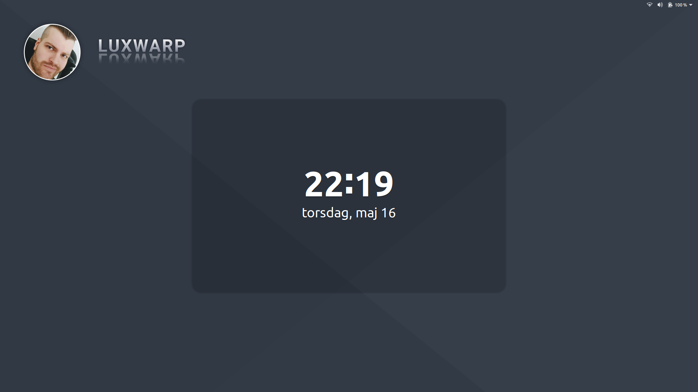

# Luxwarp Wallpaper Ubuntu

## Intro

This is my custom-made wallpaper in Luxwarp style. There is a wallpaper both for the desktop and lock screen.

Specially made for Ubuntu and works perfectly with the [Arc theme](https://github.com/horst3180/arc-theme).

Made with [InkScape](https://inkscape.org/).

## Screenshots

**Desktop**

**Lock screen**

## Files

Exported PNG files for screen size 1920x1080px are included.
Original SVG files are included so you can customize the wallpapers for your needs.

## License

ISC - © Copyright [Mikael Carlsson](http://luxwarp.info)

## Note

Feel free to contribute the way you want.